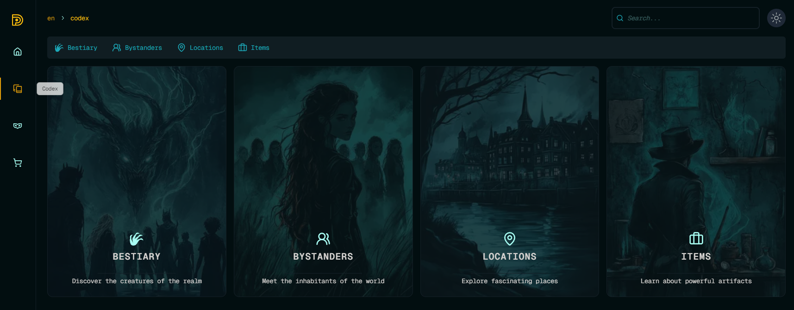

# Mandag API

The Mandag API powers the backend services for the Mandag digital toolset, a platform for the Monster Of The Week tabletop role-playing game.

## Tech Stack

- **Runtime**: [Bun](https://bun.sh/)
- **Web Framework**: [Hono](https://hono.dev/)
- **API Documentation**: [OpenAPI](https://www.openapis.org/) & [Scalar](https://scalar.com/)
- **Database**: [LibSQL](https://github.com/libsql/libsql)
- **Object Storage**: [Cloudflare R2](https://www.cloudflare.com/products/r2/)

## Current and planned Key Features

- Character management
- Digital dice rolling (planned)
- Bestiary database
- Mystery tracking
- User authentication (currently uses authjs internally)
- Homebrew content creation and sharing (planned)

An example for a potential external API that could serve as the backbone for Mandag's web application, providing secure and efficient data management for Monster Of The Week enthusiasts (Currently MotW but might have to switch later).

## Getting Started

[Include instructions for setting up and running the API locally]

## Documentation

API documentation is available [link to Scalar-generated docs when ready]

## Contributing

[Include guidelines for contributing to the API project]